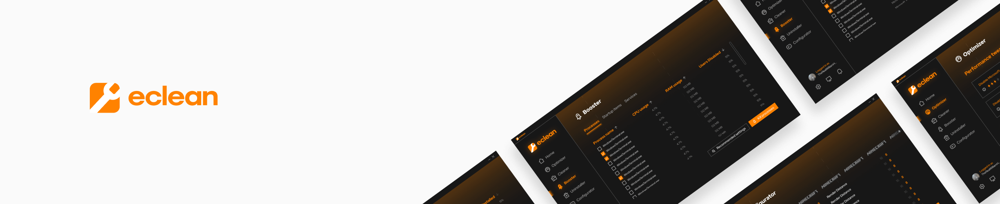

<!--
!! INSTRUCTIONS - REMOVE ME !!

The rules for writing the README file for both public and private repositories are the same. There isn't a big difference between the two types of repositories in terms of the base template. The only difference is in the badges and links.

When you update and change this README for your **PUBLIC** repository, make sure to:
    * [ ] Replace "Landing / Repository name" with the repository name
    * [ ] "Landing / Repository description" should match GitHub repository details/about
    * [ ] "About the repository" should have a heading and description
    * [ ] Replace "Repository shortcuts" with repository-specific shortcuts
    * [ ] Remove any "(OPTIONAL)" sections that don't apply to your repository

Remember that a README should be short and sweet, but it should also tell the end user everything they need to know about the repository without having to ask for help.

!! END OF INSTRUCTIONS !!
-->

<!-- Landing -->

    
     
    <!-- Repository name -->
    <h3>ecleangg/.github</h3>
    <!-- Repository description -->
    Template for eclean.gg <u>public</u> GitHub repositories
     
    <!-- Website link -->
    <a href="https://feedback.eclean.gg" target="_blank"><b>Visit website »</b></a>
     
    <!-- External links -->
    <a href="https://feedback.eclean.gg" target="_blank">Feedback</a>
    ·
    <a href="https://wiki.eclean.gg" target="_blank">Public wiki</a>
    ·
    <a href="https://blog.eclean.gg" target="_blank">Public blog</a>

 

<!-- Badges -->

    <!-- Discord -->
    
    <!-- Contributor Covenant -->
    
    <!-- Stars -->
    
    <!-- Commits per month -->
    
    <!-- Repository size -->
    

<!-- About the repository -->
# A catchy heading.

A short piece of writing about the repository and how it can help the reader. Every repository should always have a purpose that is clear and well-known.

<!-- Repository shortcuts -->
## 🔗 Shortcuts

* [.github-private Contributing Guide](https://github.com/ecleangg/.github-private/blob/main/.github/CONTRIBUTING.md)
* [.github-private Security Policy](https://github.com/ecleangg/.github-private/security/policy)
* [.github-private Code of Conduct](https://github.com/ecleangg/.github-private/blob/main/.github/CODE_OF_CONDUCT.md)

<!-- Instructions on how to build (OPTIONAL) -->

## 🔨 Build it yourself

### 🧰 Prerequisites

* A list of all the prerequisites, with links (e.g. download).

### 📋 Instructions

1. Step-by-step instructions with numbers to help the user build the repository on their own.
    * Feel free to add notes where appropriate.
2. Steps, like cloning the repository, can be skipped, but it's important to know what they are.

<!-- Environment variables (OPTIONAL) -->

## 🚀 Environment variables

* `YOUR_VARIABLE` — A short description for the variable

<!-- Config options (OPTIONAL) -->

## 🧾 Configuration options

* `CONFIG_OPTION` — A short description for the config option

<!-- Acknowledgements (IMPORTANT but OPTIONAL) -->

## 👀 Acknowledgements

*If the product you're making will be used commercially, write a list of the packages and dependencies you need under this heading. You don't have to write down the sub-dependencies. See the example below.*

* [withastro/astro](https://github.com/withastro/astro)
* [@fastify/cors](https://www.npmjs.com/package/@fastify/cors)

<!-- Contributors -->
## 💛 Contributors

